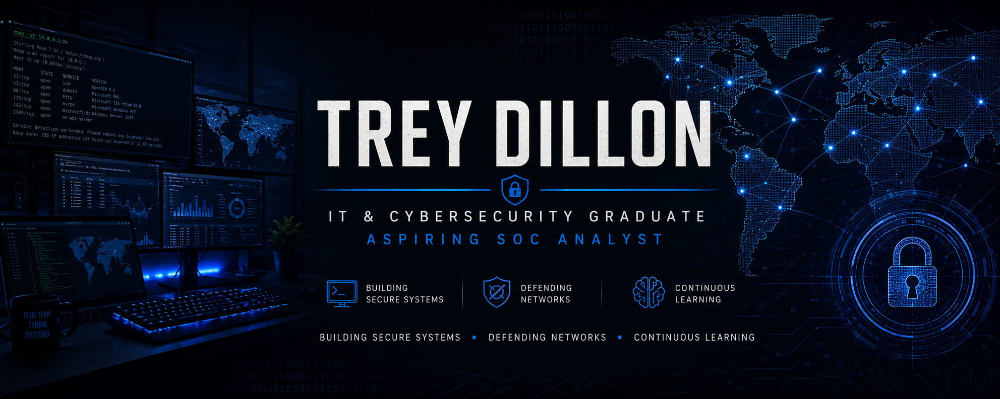

  

 </h1>

<h3 align="center">
IT & Cybersecurity Graduate | Aspiring SOC Analyst | Blue Team Enthusiast
</h3>

  Building hands-on experience in cybersecurity, system administration, and network defense through labs, virtualization, and security projects.

---

# 🛡️ About Me

I am an Information Technology Management and Cybersecurity graduate focused on building a career in Security Operations (SOC) and defensive cybersecurity.

My hands-on experience includes:

- Linux administration and troubleshooting
- Windows administration and Active Directory
- Network analysis using Wireshark
- Network scanning and enumeration with Nmap
- Virtual machine environments and home labs
- Cybersecurity training labs and security challenges

I enjoy creating practical projects that strengthen my skills in threat detection, system security, and incident response.

---

# 🧰 Technical Skills

## Operating Systems

---

## Security Tools

---

## Networking

- TCP/IP
- DNS
- DHCP
- VLAN Fundamentals
- Network Troubleshooting
- Packet Analysis
- IP Addressing & Subnetting

---

## Virtualization

- VirtualBox
- VMware
- Windows Server Labs
- Linux Server Labs

---

# 🚀 Cybersecurity Projects

## 🖥️ Home Cybersecurity Lab

Documentation of my personal cybersecurity lab environment covering Windows/Linux administration, networking, virtualization, and defensive security practice.

🔗 [View Project](https://github.com/Trey-dillon/home-cybersecurity-lab)

- Windows and Linux administration
- Networking configuration
- Security hardening
- Troubleshooting
- System management

## 🔐 Active Directory Home Lab

Enterprise-style Windows domain environment covering Active Directory, users, groups, Group Policy, and IAM concepts.

🔗 [View Project](https://github.com/Trey-dillon/active-directory-home-lab)

## 🦈 Wireshark Network Analysis Lab

Hands-on packet analysis project covering TCP/IP traffic, protocols, troubleshooting, and security monitoring concepts.

🔗 [View Project](https://github.com/Trey-dillon/wireshark-network-analysis-lab)

## 🔎 Nmap Network Scanning Lab

Hands-on network reconnaissance project covering host discovery, port scanning, service enumeration, and security assessment techniques.

🔗 [View Project](https://github.com/Trey-dillon/nmap-network-scanning-lab)

## 🛡️ SOC Analyst Log Analysis Lab

Hands-on defensive security project focused on Windows event logs, authentication monitoring, security investigations, and SIEM concepts.

🔗 [View Project](https://github.com/Trey-dillon/soc-log-analysis-lab)

Skills practiced:

- Packet capture analysis
- Network discovery
- Port scanning
- Service enumeration

## 🐧 Linux Administration Labs

Hands-on experience with:

- Ubuntu/Debian systems
- User management
- Permissions
- Firewall configuration
- Network troubleshooting

## 🔐 TryHackMe & Cyber Range Training

Completed hands-on labs covering:

- Security fundamentals
- Networking
- Linux
- Defensive security concepts
- Vulnerability assessment

---

# 📜 Certifications

🎓 CompTIA Security+ — In Progress

🌐 CompTIA Network+ — Studying

---

# 🎯 Career Objective

Seeking an entry-level SOC Analyst or Cybersecurity Analyst position where I can apply my knowledge of networking, Windows/Linux administration, security monitoring, and defensive security while continuing to grow in incident response.

---
# 📄 Resume

View my current resume:

# 📫 Connect With Me

